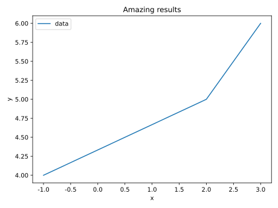
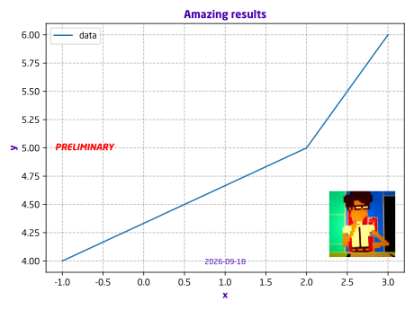

# pretty-plot

## Install

```bash
pip install https://github.com/sagitta42/pretty-plot.git
```

## Usage


```python
from pretty_plot import prettifier

ax.plot([-1, 2, 3], [4, 5, 6], label="data")
ax.set_title("Amazing results")
ax.set_xlabel("x")
ax.set_ylabel("y")
ax.legend(loc="upper left")

prettify(
  fig,
  ax,
  date=True,
  warning=True,
  warning_location="center left",
  warning_color="red",
  date_location="bottom center",
  logo_outside=False,
  logo_location="bottom right",
  logo_scale=0.002,
  warning_fontsize="medium"    
)
```

Before:



After `prettify()`:




-----
*Made with [poetiq](https://pypi.org/project/poetiq)*
